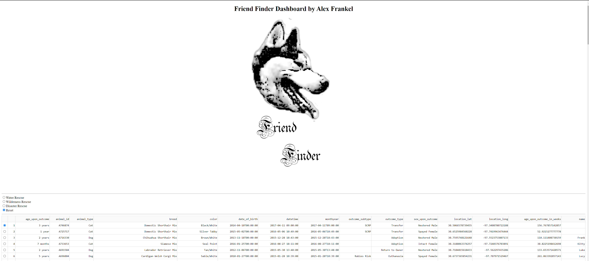
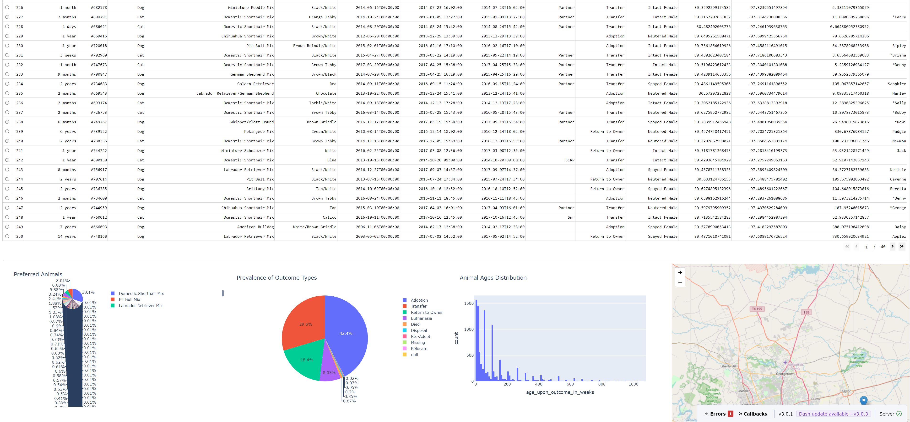
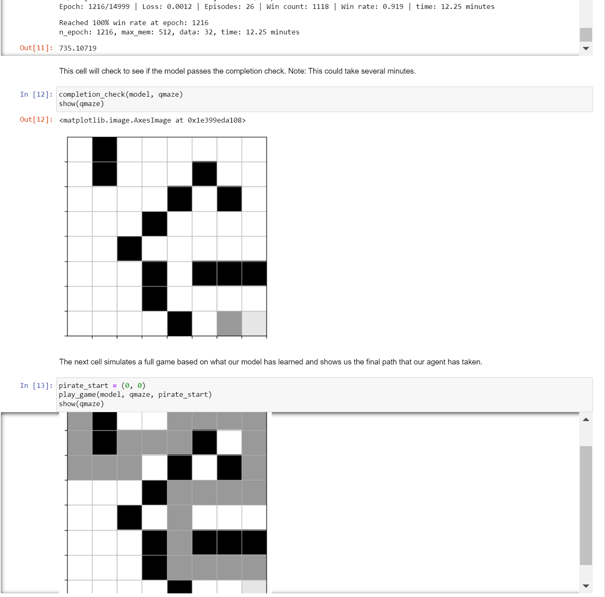

# Alex Frankel's E-Portfolio

## 
Code Review

<iframe width="800" height="600" 
    src="https://www.youtube.com/embed/zYmI5PXftYI" 
    frameborder="0" allowfullscreen></iframe>
 

My code review is a walkthrough of my artifacts originally produced as coursework at SNHU.  In this review I go through each project line-by-line and discuss my enhancement plan for this portfolio.
 

## Artifact One: Software Engineering and Design | Databases

The first of my two projects is the Friend Finder application.  It spans both categories as it is the union of both Database administration and design as well as implementing a User Interface and data visualiser.  In my enhancement I run the MongoDB server on my own machine and import the CSV file to the database (database enhancement).  I also updated deprecated methods from the old version of Dash and then swap out the hard-coded database login info in favor of a simple authentication prompt.  Finally, I added various new data visualizations to the project dashboard which granted a new insight on the raw data (software engineering/design enhancements).  

The following screenshot shows the Dashboard up and running

     
    

 

<a href="https://github.com/J00stME/J00stME.github.io/tree/main/Artifact%201%20Friend%20Finder">Access the Friend Finder files and development narrative here!</a> 

## Artifact Two: Data Structures and Algorithms

The second project is a Q-Learning, Deep Neural Network trained to solve a simple maze.  Utilizing the Q "reinforcement learning" algorithm, my enhancement is a juxtaposition of different learning parameters for the model and documenting their success (or failure).  I also made use of an Anaconda Virtual Environment so that the original (now deprecated) code could run on my system.  

The following screenshot shows a completed training session and the path the AI Agent took

 
<a href="https://github.com/J00stME/J00stME.github.io/tree/main/Artifact%202%20Maze%20Game">Access the Maze Game files and development narrative here!</a> 

